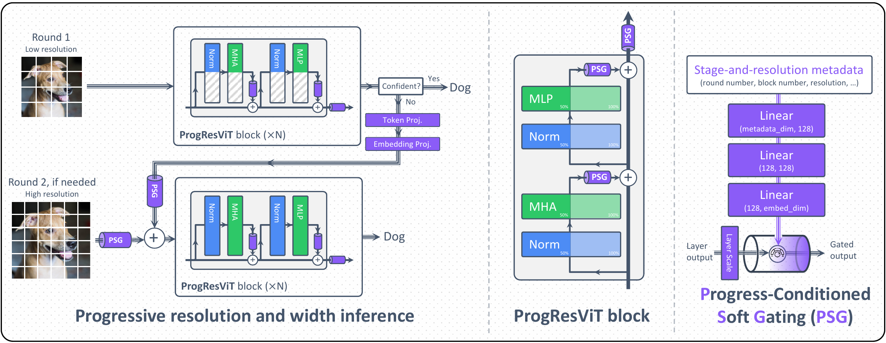

# ProgResViT: Progressive Resolution and Width for Adaptive Vision Transformers

<div align="center">

**[📄 Paper: arXiv:2609.03216](https://arxiv.org/abs/2609.03216)** · **[🤗 Hugging Face Paper](https://huggingface.co/papers/2609.03216)**

</div>



## Abstract

Vision Transformers (ViTs) typically process every image using a fixed input resolution and model width, even though many images can be classified with substantially less computation. We introduce ProgResViT, an input adaptive ViT that performs inference progressively across multiple rounds. The first round processes a low-resolution image with a narrow subnetwork. Inference terminates when the prediction is sufficiently confident; otherwise, the model reuses the representations produced in the current round and proceeds with a higher-resolution input and a wider subnetwork to refine its prediction. As all rounds share a single backbone, we propose **P**rogress-Conditioned **S**oft **G**ating (PSG), which conditions token fusion and layer outputs on the current round, block, and input resolution. On image classification, applying ProgResViT to DeiT yields better accuracy-compute trade-offs than adaptive-width, adaptive-depth, and dynamic-token baselines. With knowledge distillation, a DeiT-based ProgResViT achieves 84.9% top-1 accuracy, slightly exceeding the reported DeiT-III-S accuracy under a comparable evaluation setting. We show that the same design also provides favorable accuracy-compute trade-offs for self-supervised DINO representations and downstream semantic segmentation.

## Installation

Create an environment:

```bash
python3.12 -m venv .venv
source .venv/bin/activate
python -m pip install --upgrade pip
python -m pip install -r requirements.txt
```

ImageNet-1K layout:

```text
/path/to/imagenet/
├── train/
└── val/
```

## Training

The following command trains the `160 -> 384` model on two GPUs:

```bash
torchrun --nproc_per_node=2 train.py \
  --config 160_384 \
  --data-dir /path/to/imagenet \
  --output /path/to/output
```

For knowledge-distillation training:

```bash
torchrun --nproc_per_node=2 train.py \
  --config 160_384_kd \
  --data-dir /path/to/imagenet \
  --output /path/to/output
```

`--config` can be `192_240`, `192_240_kd`, `160_384`, or `160_384_kd`. Each preset selects the resolution schedule and the corresponding initializer; KD presets also select the teacher. The required pretrained weights are downloaded automatically.

The presets use a batch size of 512 per GPU. With two GPUs, the global batch size is 1024. For a different number of GPUs, override `--batch-size` to keep the global batch size at 1024.

## Checkpoints

Pretrained EMA checkpoints are hosted by [NCPS on Hugging Face](https://huggingface.co/NCPS). Download the required weight file into `checkpoints/`. Complete accuracy and GMAC results across routing thresholds are reported in [`results/RESULTS.md`](results/RESULTS.md).

| Resolution schedule | Training | Checkpoint | Top-1 (%) | GMACs |
|---|---|---|---:|---:|
| 192 -> 240 | Standard | [`progresvit_192_240.pth.tar`](https://huggingface.co/NCPS/progresvit-deit-s-192-240-imagenet1k) | 82.206 | 6.267 |
| 192 -> 240 | KD | [`progresvit_192_240_kd.pth.tar`](https://huggingface.co/NCPS/progresvit-deit-s-192-240-kd-imagenet1k) | 83.796 | 6.267 |
| 160 -> 384 | Standard | [`progresvit_160_384.pth.tar`](https://huggingface.co/NCPS/progresvit-deit-s-160-384-imagenet1k) | 83.700 | 16.152 |
| 160 -> 384 | KD | [`progresvit_160_384_kd.pth.tar`](https://huggingface.co/NCPS/progresvit-deit-s-160-384-kd-imagenet1k) | **84.902** | 16.152 |

### Load from Hugging Face

Run from this repository root so Python uses the included ProgResViT implementation:

```python
import torch
from timm.models import create_model

model = create_model(
    "hf-hub:NCPS/progresvit-deit-s-160-384-kd-imagenet1k",
    pretrained=True,
)
model.eval()

x = torch.randn(1, 3, 384, 384)
with torch.inference_mode():
    logits, stage = model(x, threshold=0.23)

print(logits.shape)  # (1, 1000)
print(stage)         # 0 = 160 px / 3 heads; 1 = 384 px / 6 heads
```

The model configuration and EMA weights are downloaded automatically. Replace the repository ID with any checkpoint linked in the table above.

Download all four checkpoints into `checkpoints/`:

```bash
bash download_checkpoints.sh
```

Alternatively, download any checkpoint manually from its link in the table and place it in `checkpoints/`.

## Evaluation

Evaluate a checkpoint on ImageNet-1K:

```bash
python validate.py /path/to/imagenet/val \
  --model progresvit \
  --config 160_384_kd \
  --checkpoint checkpoints/progresvit_160_384_kd.pth.tar \
  --batch-size 128 \
  --thresholds 0.00 0.10 0.20 0.30 0.50 0.80 1.00 2.00
```

`--config` can be `192_240`, `192_240_kd`, `160_384`, or `160_384_kd`. The evaluator loads the EMA weights, evaluates both rounds once, and prints top-1, top-5, average GMACs, and the first-round exit rate for every threshold.

## Routed inference

At these operating points, confident images exit after the first round while harder images continue to the second round, reducing GMACs while keeping the top-1 accuracy drop below 0.03 percentage points.

| Model | Full top-1 (%) | Threshold | Routed top-1 (%) | Routed GMACs | Saving (%) |
|---|---:|---:|---:|---:|---:|
| 192 -> 240 | 82.206 | 0.35 | 82.178 | 4.467 | 28.7 |
| 192 -> 240 + KD | 83.796 | 0.21 | 83.766 | 4.461 | 28.8 |
| 160 -> 384 | 83.700 | 0.25 | 83.672 | 12.606 | 21.9 |
| 160 -> 384 + KD | 84.902 | 0.23 | 84.872 | 11.124 | 31.1 |
